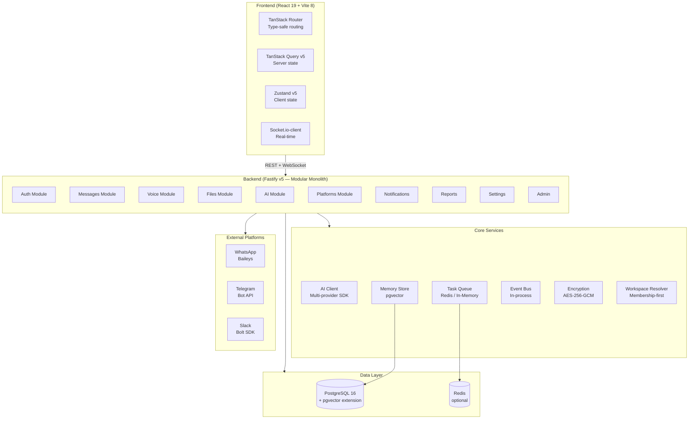
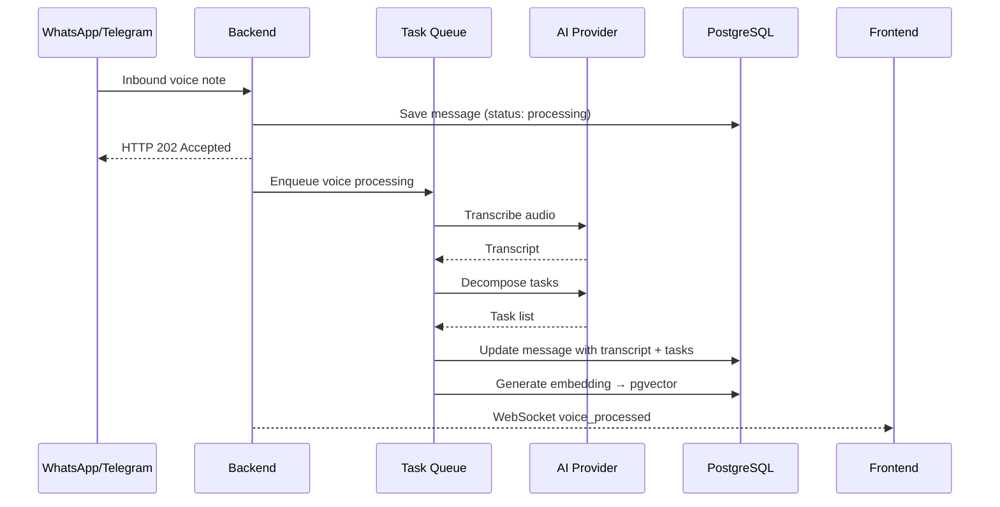
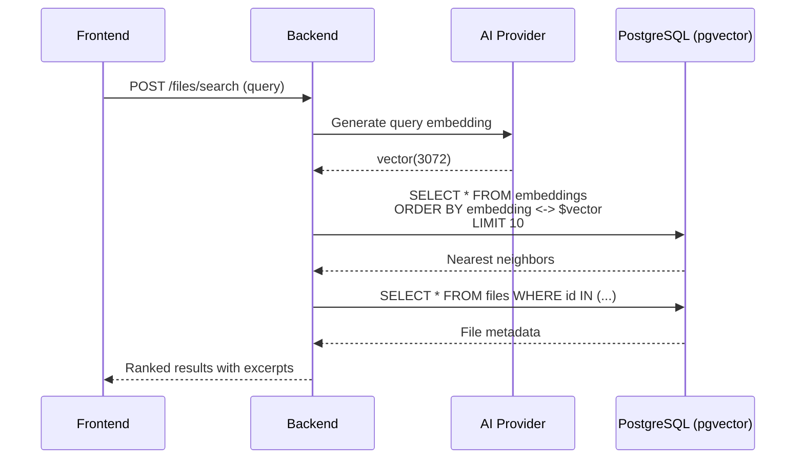
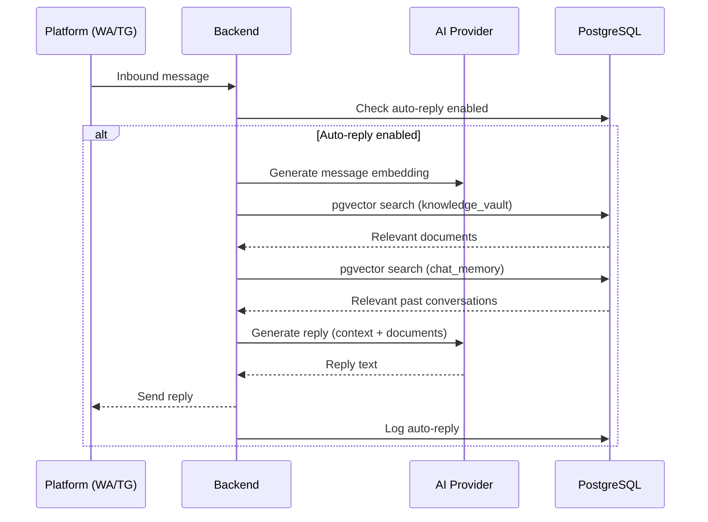

# Arsitektur Ghost Relay (Modular Monolith)

Arsitektur lengkap Ghost Relay — **Modular Monolith** dalam struktur **Monorepo** dengan Bun workspace.

---

## 1. Gambaran Arsitektur



---

## 2. Struktur Monorepo

```
Ghost-Team/
├── apps/
│   ├── backend/              # Fastify API server
│   │   └── src/
│   │       ├── core/         # AI client, encryption, memory, workspace, task queue
│   │       ├── modules/      # Domain modules (12 modules)
│   │       └── plugins/      # Fastify plugins (auth, socket)
│   └── frontend/             # React SPA
│       └── src/
│           ├── routes/       # TanStack Router pages
│           ├── components/   # UI components (shadcn/ui, ai-elements)
│           ├── hooks/        # TanStack Query hooks
│           └── stores/       # Zustand stores
├── packages/
│   ├── database/             # Prisma schema + client
│   ├── shared/               # Zod schemas + shared TypeScript types
│   └── config/               # Zod-validated env variables
├── docker-compose.yml        # PostgreSQL (pgvector) + app
├── docker-compose.full.yml   # PostgreSQL + Redis + app
├── Dockerfile                # Multi-stage build (Bun)
├── turbo.json                # Turborepo task pipeline
└── package.json              # Bun workspace root
```

---

## 3. Komunikasi Antar-Modul (Event-Driven)

Backend menggunakan **Event-Driven Architecture** di dalam memori menggunakan `EventBus` (`event-bus.ts`). Modul tetap independen (loose coupling) tanpa memanggil logic modul lain secara langsung.

**Contoh Alur:**
1. Pesan baru masuk via Webhook / REST
2. Modul mengirim event `message:created` melalui `EventBus`
3. Modul lain (voice, memory, dll.) mendengarkan event dan melakukan aksi di luar HTTP request-response cycle

---

## 4. Rincian Layer Sistem

### Layer 1: Presentation (Frontend)

| Teknologi | Peran |
|-----------|-------|
| React 19 + TypeScript | UI framework |
| TanStack Router | Type-safe client-side routing |
| TanStack Query v5 | Server state (fetching, caching, mutation) |
| Zustand v5 | Client state (UI, sidebar, filters) |
| shadcn/ui + Tailwind CSS v4 | UI components + styling |
| Socket.io-client | Real-time WebSocket connection |

---

### Layer 2: Application (Backend)

| Teknologi | Peran |
|-----------|-------|
| Fastify v5 + Bun | HTTP framework + runtime |
| Better Auth | Session-based authentication |
| Socket.io | WebSocket server |
| Zod (via @ghost/shared) | Request/response validation |

**Modules (12):**
- `auth` — Registration, login, session management
- `messages` — Chat sessions, message CRUD, search
- `voice` — Voice note processing, voice commands
- `files` — Knowledge Vault upload, semantic search
- `ai` — Multi-provider LLM chat, streaming
- `platforms` — WhatsApp/Telegram/Slack connections
- `notifications` — In-app notification system
- `reports` — Daily report generation
- `memory` — Semantic search across all content
- `settings` — Workspace, providers, invite codes
- `admin` — User/workspace management (owner only)
- `webhook` — Inbound webhooks from platforms

---

### Layer 3: Business Logic & Background Tasks

| Komponen | Peran |
|----------|-------|
| **Event Bus** (`event-bus.ts`) | In-process event broker untuk loose coupling |
| **Task Queue** (`task-queue.ts`) | BullMQ + Redis (fallback: in-memory `setImmediate`) |
| **AI Client** (`ai-client.ts`) | Multi-provider LLM (OpenAI, Gemini, Anthropic, Qwen, etc.) |
| **Memory Store** (`memory.ts`) | pgvector-based semantic search |
| **Workspace Resolver** (`workspace.ts`) | Membership-first workspace resolution |
| **Encryption** (`encryption.ts`) | AES-256-GCM credential encryption |

---

### Layer 4: Data Layer (Database & Vectors)

#### PostgreSQL 16 + pgvector

- **ORM**: Prisma v6
- **Vector Search**: pgvector native extension (`vector(3072)`)
- **Embedding Model**: Gemini embedding-001 (3072 dimensions)
- **Search Method**: Brute-force L2 distance (no HNSW index — 2000-dim limit)

#### Skema Database (Prisma)

**Key Tables:**

| Table | Purpose | Key Columns |
|-------|---------|-------------|
| `User` | User accounts | `id`, `email`, `passwordHash`, `name`, `role` |
| `Workspace` | Multi-tenant workspaces | `id`, `name`, `inviteCode`, `ownerId` |
| `WorkspaceMember` | Team membership | `userId`, `workspaceId`, `role` |
| `ChatSession` | Conversation sessions | `id`, `userId`, `workspaceId`, `title`, `platform` |
| `Message` | Chat messages | `id`, `userId`, `sessionId`, `content`, `platform`, `messageType` |
| `File` | Knowledge Vault files | `id`, `userId`, `workspaceId`, `originalName`, `storagePath` |
| `Embedding` | Vector embeddings | `id`, `referenceId`, `collection`, `document`, `embedding vector(3072)` |
| `PlatformConnection` | Platform integrations | `id`, `userId`, `platform`, `credentialsEncrypted` |
| `AIProvider` | LLM provider configs | `id`, `userId`, `providerType`, `apiKey`, `modelName` |
| `Notification` | In-app notifications | `id`, `userId`, `title`, `message`, `isRead` |
| `AutoReplyLog` | Auto-reply history | `id`, `workspaceId`, `triggerMessageId`, `replyMessageId` |

#### Keputusan Arsitektural: Tanpa Foreign Key Constraints

15 dari 17 relasi FK dihapus dari schema. Hanya `Session.user` dan `Account.user` yang dipertahankan (wajib untuk Better Auth adapter).

**Alasan:**
- Memudahkan dekomposisi microservice di masa depan
- Referential integrity dijaga di application layer
- Semua `@@index` dipertahankan untuk query performance
- Workspace resolution via helper functions (`findWorkspaceByMember`, `findWorkspaceByMemberRole`)

---

### Layer 5: External Integrations

| Platform | Metode | SDK/Library |
|----------|--------|-------------|
| WhatsApp | WebSocket + webhook | Baileys |
| Telegram | Bot API + webhook | grammy / node-telegram-bot-api |
| Slack | Bolt SDK + Socket Mode | @slack/bolt |
| LLM Providers | REST API | Vercel AI SDK (`ai` + `@ai-sdk/*`) |

---

## 5. Alur Data Utama

### Skenario 1: Voice Note Processing



### Skenario 2: Semantic Search (Knowledge Vault)



### Skenario 3: Auto-Reply (RAG)



---

## 6. Security Architecture

| Komponen | Implementasi |
|----------|-------------|
| **Authentication** | Better Auth (session-based, Prisma adapter) |
| **Credential Encryption** | AES-256-GCM (sebelumnya AES-256-CBC) |
| **API Key Masking** | Masked di response (e.g., `sk-m***-key`) |
| **Access Control** | File scope (`workspace` / `private`), workspace membership |
| **CORS** | Configurable allowed origins |
| **Body Limit** | 5MB max request size |
| **Webhook Auth** | HMAC-SHA256 (Slack), secret token (Telegram) |
| **Default Secrets** | Fatal error di production jika menggunakan default values |

---

## 7. Design Patterns

| Pola | Implementasi | Alasan |
|------|-------------|--------|
| **Modular Monolith** | `apps/backend/src/modules/` | Domain logika terpisah dalam satu proses — mudah deploy, siap decompose |
| **Monorepo** | Bun workspaces + Turborepo | Sharing tipe/skema antar package |
| **Event-Driven** | In-process `EventBus` | Loose coupling antar modul |
| **Repository Pattern** | Prisma client per module | Clean data access layer |
| **Manual Lookups** | No FK, application-level joins | Microservice-ready, independent schema evolution |
| **Task Queue** | BullMQ + Redis (in-memory fallback) | Background processing tanpa dependency wajib |
| **Vector Search** | pgvector native | No external service needed (ChromaDB, Pinecone, dll.) |

---

## 8. Deployment

| Target | Method |
|--------|--------|
| **Local Dev** | `bun dev` (concurrent backend + frontend) |
| **Docker** | `docker compose up -d` (PostgreSQL + app) |
| **Cloud** | Alibaba Cloud ECS via SSH (see `DEPLOYMENT.md`) |
| **CI/CD** | GitHub Actions (build → typecheck → lint → test → deploy) |
