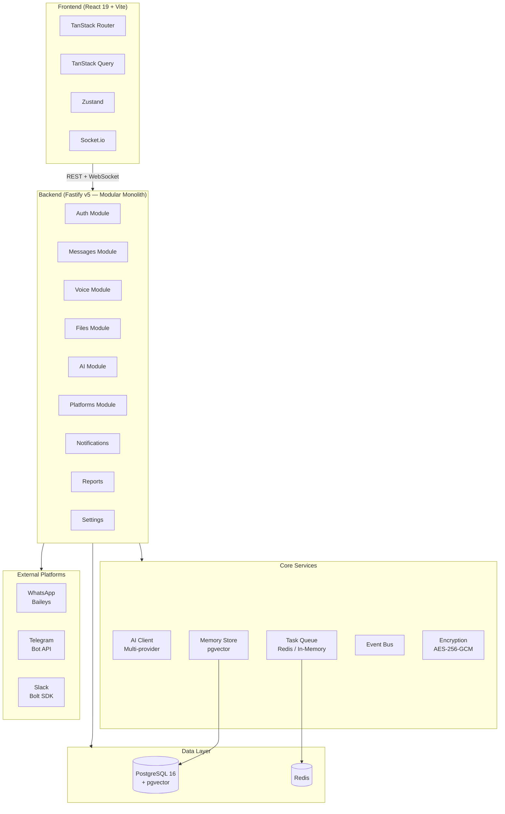
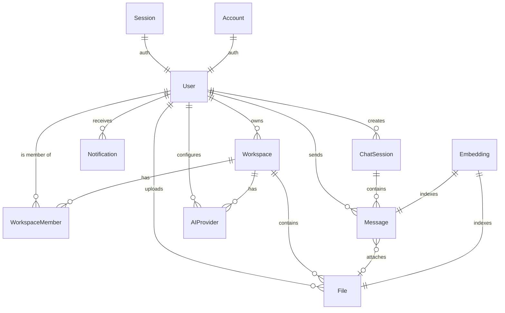

# Ghost Relay — Jembatan Koordinasi Tim

[Read in English](README.md)

---

> AI sebagai perantara komunikasi antar anggota tim. Bukan cuma chat aggregator — Ghost Relay mengubah, mengingat, dan menjawab.

## Kenapa Ini Penting

Tim remote punya masalah yang sama: **komunikasi asinkron yang kacau.**

Pesan masuk dari WhatsApp, Telegram, Slack, dan website. Masing-masing inbox terpisah. Voice note menumpuk. Dokumen berserakan. Pertanyaan yang sama diulang terus. Tim baru gabung tapi tidak tahu riwayat. Yang bekerja malam tidak tahu apa yang terjadi siang. Yang kerja siang tidak tahu keputusan malam.

**Hasilnya:** waktu habis untuk scroll chat, dengar voice note, dan tanya ulang — bukan untuk kerja.

Ghost Relay menyelesaikan ini dengan pendekatan **Human → AI → Human**: AI menerima dari satu sisi, memproses, dan menyampaikan ke sisi lain — lebih cepat, lebih terstruktur, tanpa kehilangan konteks.

## Masalah yang Dipecahkan

| Masalah | Dampak | Solusi Ghost Relay |
|---------|--------|-------------------|
| **Inbox terpisah** di 3+ platform | Pesan terlewat, pelanggan kabur | **Universal Inbox** — semua pesan dalam satu feed real-time |
| **Voice note menumpuk** | Keputusan penting terlewat | **Voice Intelligence** — otomatis transkripsi, ringkas, pecah jadi tugas |
| **Pertanyaan berulang** | Tim frustrasi, waktu terbuang | **Auto-Reply RAG** — AI jawab pakai riwayat chat + dokumen sendiri |
| **File & dokumen hilang** | Butuh menit untuk cari file | **Knowledge Vault** — semantic search, otomatis terindeks |
| **Tidak ada ingatan** | AI mulai dari nol setiap kali | **Memory** — vector search sejarah percakapan + dokumen |
| **Tim baru gabung** | Harus tanya satu per satu | **Knowledge Vault + Auto-Reply** — semua pengetahuan bisa dicari |
| **Tidak ada visibility** | Kerja tumpang tindih | **Daily Reports** — rangkuman aktivitas harian otomatis |

## Siapa yang Dirancang Untuk

| Persona | Peran | Masalahnya | Ghost Relay Menjawab |
|---------|------|-----------|---------------------|
| **Andi** | Backend Engineer | Males buka HP, males dengerin voice note, gak suka scroll chat | Kirim/pesan via UI PC, semua voice note jadi teks |
| **Budi** | Project Manager | Ngirim instruksi panjang lewat voice note, tim selalu nanya ulang | Cukup ngomong 1 kali, AI pecah tugas & ingatkan otomatis |
| **Citra** | Frontend Engineer | Ketinggalan info karena pesan di WA, diskusi di Slack | Semua pesan masuk dalam satu feed chat yang rapi |

## Dampak

- **70% waktu koordinasi** tersisa — tidak perlu scroll chat, dengar voice note, tanya ulang
- **5 menit → 10 detik** — waktu mencari dokumen lama
- **90% pertanyaan berulang** terminimalisir — AI jawab pakai referensi otomatis
- **100% voice note** otomatis ter-transkrip dan ter-ringkas

## Arsitektur



## Tech Stack

| Layer | Teknologi |
|-------|-----------|
| **Frontend** | React 19, TypeScript, Vite 8, Tailwind CSS v4, shadcn/ui |
| **Routing** | TanStack Router (type-safe) |
| **Server State** | TanStack Query v5 |
| **Client State** | Zustand v5 |
| **Backend** | Fastify v5, TypeScript, Bun runtime |
| **Database** | PostgreSQL 16 + Prisma ORM |
| **Vector Search** | pgvector (`vector(3072)`) — native PostgreSQL extension |
| **Task Queue** | BullMQ + Redis (fallback: in-memory `setImmediate`) |
| **Real-time** | Socket.io (server + client) |
| **AI SDK** | Vercel AI SDK (`ai` + `@ai-sdk/google`, `@ai-sdk/openai`, `@ai-sdk/anthropic`) |
| **Auth** | Better Auth (session-based) |
| **Encryption** | AES-256-GCM |
| **Package Manager** | Bun (workspace monorepo) + Turborepo |
| **Container** | Docker + Docker Compose |

## Struktur Proyek

```
ghost-team/
├── apps/
│   ├── backend/              # Fastify API server
│   │   └── src/
│   │       ├── core/         # AI, enkripsi, memori, workspace, task queue
│   │       ├── modules/      # Modul domain (auth, messages, voice, files, dll.)
│   │       └── plugins/      # Fastify plugins (auth, socket)
│   └── frontend/             # React SPA
│       └── src/
│           ├── routes/       # Halaman TanStack Router
│           ├── components/   # Komponen UI (shadcn/ui, ai-elements)
│           ├── hooks/        # React Hooks (TanStack Query)
│           └── stores/       # Zustand stores
├── packages/
│   ├── database/             # Prisma schema + client
│   ├── shared/               # Zod schemas + tipe data TS bersama
│   └── config/               # Zod-validated env variables
├── docker-compose.yml        # PostgreSQL (pgvector) + app
├── docker-compose.full.yml   # PostgreSQL + Redis + app
└── Dockerfile                # Multi-stage build (Bun)
```

## Panduan Cepat

### Persyaratan

- **Bun** 1.1+ — `curl -fsSL https://bun.sh/install | bash`
- **PostgreSQL 16** dengan pgvector (atau pakai Docker)

### 1. Instalasi

```bash
git clone https://github.com/crediblemark-official/Ghost-Relay.git
cd Ghost-Relay
bun install
bun run db:generate
```

### 2. Setup Environment

```bash
cp .env.example .env
# Isi variabel minimum yang dibutuhkan (lihat bagian Variabel Lingkungan di bawah)
```

Atau jalankan PostgreSQL via Docker:

```bash
docker compose up -d db    # PostgreSQL pada port 5433
```

### 3. Migrasi Database

```bash
bun run db:push
```

### 4. Jalankan Server Development

```bash
bun dev
```

- **Backend**: http://localhost:8000
- **Frontend**: http://localhost:5173

### 5. Masuk Log / Login

Pengguna pertama otomatis ditunjuk sebagai `owner` / pemilik platform:

- **Email**: `admin@ghost.local`
- **Password**: `admin123`

## Docker

```bash
# Production (PostgreSQL + app)
docker compose up -d

# Full stack (PostgreSQL + Redis + app)
docker compose -f docker-compose.full.yml up -d
```

### Deployment ke Alibaba Cloud ECS

Lihat **[deployment.md](docs/deployment.md)** untuk panduan langkah-demi-langkah dengan script otomatis.

## Variabel Lingkungan

| Variable | Wajib | Default | Deskripsi |
|----------|-------|---------|-------------|
| `DATABASE_URL` | Ya | — | PostgreSQL connection string |
| `JWT_SECRET_KEY` | Ya | — | Secret untuk JWT signing (min 32 karakter) |
| `BETTER_AUTH_SECRET` | Ya | — | Secret untuk Better Auth sessions |
| `ENCRYPTION_KEY` | Ya | — | AES-256-GCM encryption key |
| `CRYPTO_SALT` | Ya | — | Salt untuk key derivation |
| `REDIS_URL` | Tidak | `""` | Redis URL (kosong = in-memory fallback) |
| `CORS_ORIGINS` | Tidak | `["*"]` | Allowed CORS origins |
| `ENVIRONMENT` | Tidak | `production` | `development` / `production` / `test` |
| `ADMIN_EMAIL` | Tidak | `admin@ghost.local` | Email admin seeder |
| `ADMIN_PASSWORD` | Tidak | `admin123` | Password admin seeder |
| `DASHSCOPE_API_KEY` | Tidak | — | API key Alibaba DashScope / Qwen |
| `TELEGRAM_BOT_TOKEN` | Tidak | — | Telegram bot token |

## Endpoint API

<details>
<summary><b>Auth</b></summary>

| Metode | Path | Deskripsi |
|--------|------|-------------|
| `POST` | `/api/auth/sign-up/email` | Daftar user baru |
| `POST` | `/api/auth/sign-in/email` | Login |
| `POST` | `/api/auth/sign-out` | Logout |
| `GET` | `/api/auth/get-session` | Dapatkan sesi saat ini |

</details>

<details>
<summary><b>Pesan & Sesi</b></summary>

| Metode | Path | Deskripsi |
|--------|------|-------------|
| `GET` | `/api/sessions` | List sesi obrolan |
| `POST` | `/api/sessions` | Buat sesi baru |
| `DELETE` | `/api/sessions/:id` | Hapus sesi obrolan |
| `PATCH` | `/api/sessions/:id` | Ganti nama sesi |
| `POST` | `/api/sessions/:id/generate-title` | Buat judul otomatis via AI |
| `POST` | `/api/sessions/:id/summarize` | Ringkas isi sesi chat |
| `GET` | `/api/messages` | Dapatkan pesan (paginated) |
| `POST` | `/api/messages/send` | Kirim pesan |
| `POST` | `/api/messages/search` | Cari isi pesan |
| `DELETE` | `/api/messages/:id` | Hapus pesan |

</details>

<details>
<summary><b>AI</b></summary>

| Metode | Path | Deskripsi |
|--------|------|-------------|
| `POST` | `/api/ai/chat/stream` | Streaming chat (SSE) |
| `GET` | `/api/ai/providers` | List provider |
| `POST` | `/api/ai/providers` | Buat provider baru |
| `PUT` | `/api/ai/providers/:id` | Update provider |
| `DELETE` | `/api/ai/providers/:id` | Hapus provider |
| `GET` | `/api/ai/providers/models` | List semua model aktif |
| `GET` | `/api/ai/models/browse` | Jelajahi katalog model |
| `GET` | `/api/ai/providers/browse` | Jelajahi katalog provider |
| `POST` | `/api/ai/providers/test` | Test koneksi provider |

</details>

<details>
<summary><b>Suara / Voice</b></summary>

| Metode | Path | Deskripsi |
|--------|------|-------------|
| `POST` | `/api/voice/process` | Proses voice note |
| `POST` | `/api/voice/command` | Perintah suara (audio) |
| `POST` | `/api/voice/command-text` | Perintah suara (teks) |
| `GET` | `/api/voice/status/:id` | Cek status pemrosesan suara |

</details>

<details>
<summary><b>Files (Knowledge Vault)</b></summary>

| Metode | Path | Deskripsi |
|--------|------|-------------|
| `GET` | `/api/files` | List file terunggah |
| `POST` | `/api/files/upload` | Upload file |
| `POST` | `/api/files/search` | Pencarian semantik RAG |
| `GET` | `/api/files/download/:fileId` | Unduh file |
| `PATCH` | `/api/files/:fileId/access` | Ubah cakupan akses file |
| `DELETE` | `/api/files/:fileId` | Hapus file |

</details>

<details>
<summary><b>Pengaturan & Workspace</b></summary>

| Metode | Path | Deskripsi |
|--------|------|-------------|
| `GET` | `/api/settings/workspace` | Dapatkan nama workspace |
| `GET` | `/api/settings/workspace/members` | List anggota workspace |
| `POST` | `/api/settings/invite/generate` | Buat kode undangan |
| `POST` | `/api/settings/invite/regenerate` | Regenerasi kode undangan |
| `GET` | `/api/settings/invite/:code` | Dapatkan info undangan |
| `POST` | `/api/settings/invite/accept` | Terima undangan |
| `POST` | `/api/settings/onboarding` | Selesaikan onboarding |
| `GET` | `/api/settings/platforms` | List koneksi platform |
| `POST` | `/api/settings/platforms` | Buat koneksi platform |
| `PUT` | `/api/settings/platforms/:id` | Update koneksi platform |
| `DELETE` | `/api/settings/platforms/:id` | Hapus koneksi platform |
| `POST` | `/api/settings/platforms/test` | Test koneksi platform |
| `GET/POST` | `/api/settings/auto-reply` | Toggle auto-reply |

</details>

<details>
<summary><b>Notifikasi</b></summary>

| Metode | Path | Deskripsi |
|--------|------|-------------|
| `GET` | `/api/notifications` | List notifikasi |
| `GET` | `/api/notifications/unread-count` | Dapatkan jumlah notifikasi baru |
| `POST` | `/api/notifications/:id/read` | Tandai telah dibaca |
| `POST` | `/api/notifications/send` | Kirim notifikasi manual |

</details>

<details>
<summary><b>Laporan / Reports</b></summary>

| Metode | Path | Deskripsi |
|--------|------|-------------|
| `GET` | `/api/reports/daily` | Dapatkan laporan harian |
| `POST` | `/api/reports/generate` | Generasi laporan baru |
| `POST` | `/api/reports/email` | Kirim laporan via email |

</details>

<details>
<summary><b>Admin</b> (Khusus Owner)</summary>

| Metode | Path | Deskripsi |
|--------|------|-------------|
| `GET` | `/api/admin/check` | Cek peran admin user |
| `GET` | `/api/admin/workspaces` | List semua workspace sistem |
| `GET` | `/api/admin/users` | List semua user sistem |

</details>

<details>
<summary><b>Webhooks</b></summary>

| Metode | Path | Deskripsi |
|--------|------|-------------|
| `POST` | `/api/webhook/telegram` | Webhook Telegram |
| `GET/POST` | `/api/webhook/whatsapp` | Webhook WhatsApp (Baileys) |
| `POST` | `/api/webhook/slack` | Webhook Slack |

</details>

## Desain Database

Tidak ada batasan foreign key di tingkat database — integritas referensial ditegakkan di tingkat aplikasi. Hal ini memungkinkan dekomposisi microservice yang bersih di kemudian hari.



## Keamanan

- **Kredensial**: API key dienkripsi dengan AES-256-GCM sebelum disimpan di PostgreSQL.
- **Otentikasi**: Berbasis sesi via Better Auth.
- **Penyamaran Key**: API Key disamarkan dalam respons API (contoh: `sk-••••••••1234`).
- **CORS**: Domain CORS yang diizinkan dapat dikonfigurasi.
- **Batas Payload**: Maksimal ukuran request adalah 5MB.
- **Webhook Auth**: HMAC-SHA256 (Slack), secret token (Telegram).
- **Kontrol Akses**: Cakupan akses file terbatas berdasarkan workspace & status keanggotaan.

---

## Lisensi

[MIT](LICENSE)
