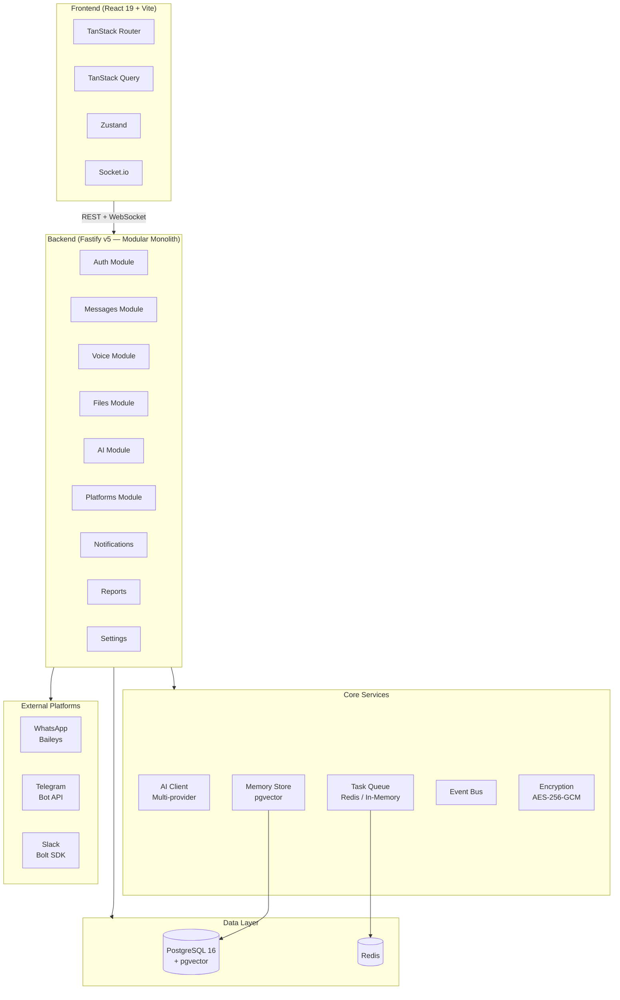
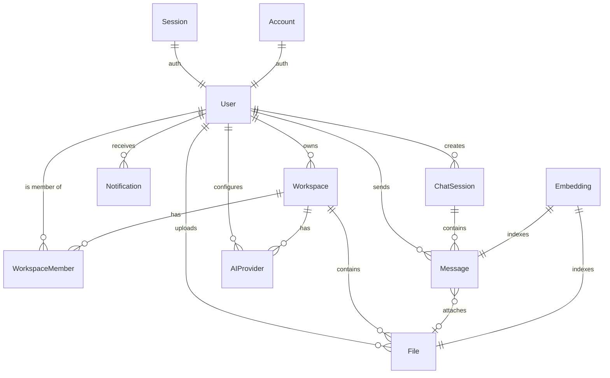

# Ghost Relay — Team Coordination Bridge

[Baca dalam Bahasa Indonesia](README.id.md)

---

> AI as a communication bridge between team members. More than just a chat aggregator — Ghost Relay transforms, remembers, and replies.

## Why This Matters

Remote teams face the same issue: **chaotic asynchronous communication.**

Messages pour in from WhatsApp, Telegram, Slack, and the web. Each inbox is isolated. Voice notes pile up. Documents get lost. The same questions are asked repeatedly. New hires have no access to historical discussions. Night owls miss daytime context; daytime workers miss decisions made at night.

**The result:** hours wasted scrolling chat feeds, listening to voice notes, and repeating answers — instead of building.

Ghost Relay solves this with a **Human → AI → Human** approach: the AI receives input from one side, processes and structures it, and relays it to the other — faster, cleaner, without losing context.

## Problems Solved

| Problem | Impact | Ghost Relay Solution |
|---------|--------|---------------------|
| **Fragmented Inboxes** (3+ platforms) | Missed messages, lost leads | **Universal Inbox** — unified real-time feed |
| **Voice Note Overload** | Key decisions overlooked | **Voice Intelligence** — auto-transcribes, summarizes, decomposes into tasks |
| **Repetitive Questions** | Frustration, wasted engineering time | **Auto-Reply RAG** — AI replies using chat history + local documents |
| **Lost Files & Documents** | Minutes spent digging for files | **Knowledge Vault** — semantic search, auto-indexed attachments |
| **No Long-term Memory** | AI starts from scratch every session | **Memory** — pgvector search over conversations + documents |
| **New Hires Onboarding** | Repetitive manual handovers | **Knowledge Vault + Auto-Reply** — searchable organizational knowledge |
| **Lack of Team Visibility** | Overlapping work | **Daily Reports** — automated daily activity summaries |

## Who It Is For

| Persona | Role | Pain Point | Ghost Relay Solution |
|---------|------|------------|----------------------|
| **Andi** | Backend Engineer | Dislikes opening phone, listening to audio, or scrolling | Send/receive via PC UI, audio transcribed instantly |
| **Budi** | Project Manager | Sends long audio, team repeats questions | Speaks once, AI decomposes tasks & auto-notifies division |
| **Citra** | Frontend Engineer | Misses WA info, technical discussions on Slack | Multi-platform messages in a single clean feed |

## Key Impacts

- **70% coordination time saved** — no more chat scrubbing or listening to voice notes.
- **5 minutes → 10 seconds** — time spent finding documents.
- **90% repetitive questions eliminated** — AI auto-replies with references.
- **100% voice notes** transcribed and summarized automatically.

## Architecture



## Tech Stack

| Layer | Technology |
|-------|-----------|
| **Frontend** | React 19, TypeScript, Vite 8, Tailwind CSS v4, shadcn/ui |
| **Routing** | TanStack Router (type-safe) |
| **Server State** | TanStack Query v5 |
| **Client State** | Zustand v5 |
| **Backend** | Fastify v5, TypeScript, Bun runtime |
| **Database** | PostgreSQL 16 + Prisma ORM |
| **Vector Search** | pgvector (`vector(3072)`) — native PostgreSQL extension |
| **Task Queue** | BullMQ + Redis (fallback: in-memory `setImmediate`) |
| **Real-time** | Socket.io (server + client) |
| **AI SDK** | Vercel AI SDK (`ai` + `@ai-sdk/google`, `@ai-sdk/openai`, `@ai-sdk/anthropic`) |
| **Auth** | Better Auth (session-based) |
| **Encryption** | AES-256-GCM |
| **Package Manager** | Bun (workspace monorepo) + Turborepo |
| **Container** | Docker + Docker Compose |

## Project Structure

```
ghost-team/
├── apps/
│   ├── backend/              # Fastify API server
│   │   └── src/
│   │       ├── core/         # AI, encryption, memory, workspace, task queue
│   │       ├── modules/      # Domain modules (auth, messages, voice, files, etc.)
│   │       └── plugins/      # Fastify plugins (auth, socket)
│   └── frontend/             # React SPA
│       └── src/
│           ├── routes/       # TanStack Router pages
│           ├── components/   # UI components (shadcn/ui, ai-elements)
│           ├── hooks/        # TanStack Query hooks
│           └── stores/       # Zustand stores
├── packages/
│   ├── database/             # Prisma schema + client
│   ├── shared/               # Zod schemas + shared TypeScript types
│   └── config/               # Zod-validated env variables
├── docker-compose.yml        # PostgreSQL (pgvector) + app
├── docker-compose.full.yml   # PostgreSQL + Redis + app
└── Dockerfile                # Multi-stage build (Bun)
```

## Quick Start

### Prerequisites

- **Bun** 1.1+ — `curl -fsSL https://bun.sh/install | bash`
- **PostgreSQL 16** with pgvector (or use Docker)

### 1. Install

```bash
git clone https://github.com/crediblemark-official/Ghost-Relay.git
cd Ghost-Relay
bun install
bun run db:generate
```

### 2. Setup Environment

```bash
cp .env.example .env
# Fill in minimum required variables (see Environment Variables below)
```

Or use Docker for PostgreSQL:

```bash
docker compose up -d db    # PostgreSQL on port 5433
```

### 3. Push Database Schema

```bash
bun run db:push
```

### 4. Run Development

```bash
bun dev
```

- **Backend**: http://localhost:8000
- **Frontend**: http://localhost:5173

### 5. Login

First user is automatically assigned `owner` role:

- **Email**: `admin@ghost.local`
- **Password**: `admin123`

## Docker

```bash
# Production (PostgreSQL + app)
docker compose up -d

# Full stack (PostgreSQL + Redis + app)
docker compose -f docker-compose.full.yml up -d
```

### Deploy to Alibaba Cloud ECS

See **[deployment.md](docs/deployment.md)** for step-by-step guide with automated script.

## Environment Variables

| Variable | Required | Default | Description |
|----------|----------|---------|-------------|
| `DATABASE_URL` | Yes | — | PostgreSQL connection string |
| `JWT_SECRET_KEY` | Yes | — | Secret for JWT signing (min 32 chars) |
| `BETTER_AUTH_SECRET` | Yes | — | Secret for Better Auth sessions |
| `ENCRYPTION_KEY` | Yes | — | AES-256-GCM encryption key |
| `CRYPTO_SALT` | Yes | — | Salt for key derivation |
| `REDIS_URL` | No | `""` | Redis URL (empty = in-memory fallback) |
| `CORS_ORIGINS` | No | `["*"]` | Allowed CORS origins |
| `ENVIRONMENT` | No | `production` | `development` / `production` / `test` |
| `ADMIN_EMAIL` | No | `admin@ghost.local` | Admin seeder email |
| `ADMIN_PASSWORD` | No | `admin123` | Admin seeder password |
| `DASHSCOPE_API_KEY` | No | — | Alibaba DashScope / Qwen API key |
| `TELEGRAM_BOT_TOKEN` | No | — | Telegram bot token |

## API Endpoints

<details>
<summary><b>Auth</b></summary>

| Method | Path | Description |
|--------|------|-------------|
| `POST` | `/api/auth/sign-up/email` | Register new user |
| `POST` | `/api/auth/sign-in/email` | Login |
| `POST` | `/api/auth/sign-out` | Logout |
| `GET` | `/api/auth/get-session` | Get current session |

</details>

<details>
<summary><b>Messages & Sessions</b></summary>

| Method | Path | Description |
|--------|------|-------------|
| `GET` | `/api/sessions` | List chat sessions |
| `POST` | `/api/sessions` | Create session |
| `DELETE` | `/api/sessions/:id` | Delete session |
| `PATCH` | `/api/sessions/:id` | Rename session |
| `POST` | `/api/sessions/:id/generate-title` | Auto-generate title |
| `POST` | `/api/sessions/:id/summarize` | Summarize session |
| `GET` | `/api/messages` | Get messages (paginated) |
| `POST` | `/api/messages/send` | Send message |
| `POST` | `/api/messages/search` | Search messages |
| `DELETE` | `/api/messages/:id` | Delete message |

</details>

<details>
<summary><b>AI</b></summary>

| Method | Path | Description |
|--------|------|-------------|
| `POST` | `/api/ai/chat/stream` | Streaming chat (SSE) |
| `GET` | `/api/ai/providers` | List providers |
| `POST` | `/api/ai/providers` | Create provider |
| `PUT` | `/api/ai/providers/:id` | Update provider |
| `DELETE` | `/api/ai/providers/:id` | Delete provider |
| `GET` | `/api/ai/providers/models` | List models across providers |
| `GET` | `/api/ai/models/browse` | Browse available models |
| `GET` | `/api/ai/providers/browse` | Browse supported providers |
| `POST` | `/api/ai/providers/test` | Test provider connection |

</details>

<details>
<summary><b>Voice</b></summary>

| Method | Path | Description |
|--------|------|-------------|
| `POST` | `/api/voice/process` | Process voice note |
| `POST` | `/api/voice/command` | Voice command (audio) |
| `POST` | `/api/voice/command-text` | Voice command (text) |
| `GET` | `/api/voice/status/:id` | Check processing status |

</details>

<details>
<summary><b>Files (Knowledge Vault)</b></summary>

| Method | Path | Description |
|--------|------|-------------|
| `GET` | `/api/files` | List files |
| `POST` | `/api/files/upload` | Upload file |
| `POST` | `/api/files/search` | Semantic search |
| `GET` | `/api/files/download/:fileId` | Download file |
| `PATCH` | `/api/files/:fileId/access` | Update access scope |
| `DELETE` | `/api/files/:fileId` | Delete file |

</details>

<details>
<summary><b>Settings & Workspace</b></summary>

| Method | Path | Description |
|--------|------|-------------|
| `GET` | `/api/settings/workspace` | Get workspace name |
| `GET` | `/api/settings/workspace/members` | List workspace members |
| `POST` | `/api/settings/invite/generate` | Generate invite code |
| `POST` | `/api/settings/invite/regenerate` | Regenerate invite code |
| `GET` | `/api/settings/invite/:code` | Get invite info (public) |
| `POST` | `/api/settings/invite/accept` | Accept invite |
| `POST` | `/api/settings/onboarding` | Complete onboarding |
| `GET` | `/api/settings/platforms` | List platform connections |
| `POST` | `/api/settings/platforms` | Create platform connection |
| `PUT` | `/api/settings/platforms/:id` | Update platform |
| `DELETE` | `/api/settings/platforms/:id` | Delete platform |
| `POST` | `/api/settings/platforms/test` | Test platform connection |
| `GET/POST` | `/api/settings/auto-reply` | Auto-reply toggle |

</details>

<details>
<summary><b>Notifications</b></summary>

| Method | Path | Description |
|--------|------|-------------|
| `GET` | `/api/notifications` | List notifications |
| `GET` | `/api/notifications/unread-count` | Unread count |
| `POST` | `/api/notifications/:id/read` | Mark as read |
| `POST` | `/api/notifications/send` | Send notification |

</details>

<details>
<summary><b>Reports</b></summary>

| Method | Path | Description |
|--------|------|-------------|
| `GET` | `/api/reports/daily` | Get daily report |
| `POST` | `/api/reports/generate` | Generate report |
| `POST` | `/api/reports/email` | Email report |

</details>

<details>
<summary><b>Admin</b> (owner only)</summary>

| Method | Path | Description |
|--------|------|-------------|
| `GET` | `/api/admin/check` | Check user role |
| `GET` | `/api/admin/workspaces` | List all workspaces |
| `GET` | `/api/admin/users` | List all users |

</details>

<details>
<summary><b>Webhooks</b></summary>

| Method | Path | Description |
|--------|------|-------------|
| `POST` | `/api/webhook/telegram` | Telegram webhook |
| `GET/POST` | `/api/webhook/whatsapp` | WhatsApp (Baileys) |
| `POST` | `/api/webhook/slack` | Slack webhook |

</details>

## Database Design

No foreign key constraints at database level — referential integrity enforced at application layer. This enables clean microservice decomposition later.



## Security

- **Credentials**: API keys encrypted with AES-256-GCM before storage
- **Auth**: Session-based via Better Auth
- **API Keys**: Masked in API responses (e.g., `sk-••••••••1234`)
- **CORS**: Configurable allowed origins
- **Body Limit**: 5MB max request size
- **Webhook Auth**: HMAC-SHA256 (Slack), secret token (Telegram)
- **Access Control**: File access scope (`workspace` / `private`), workspace membership

---

## License

[MIT](LICENSE)
