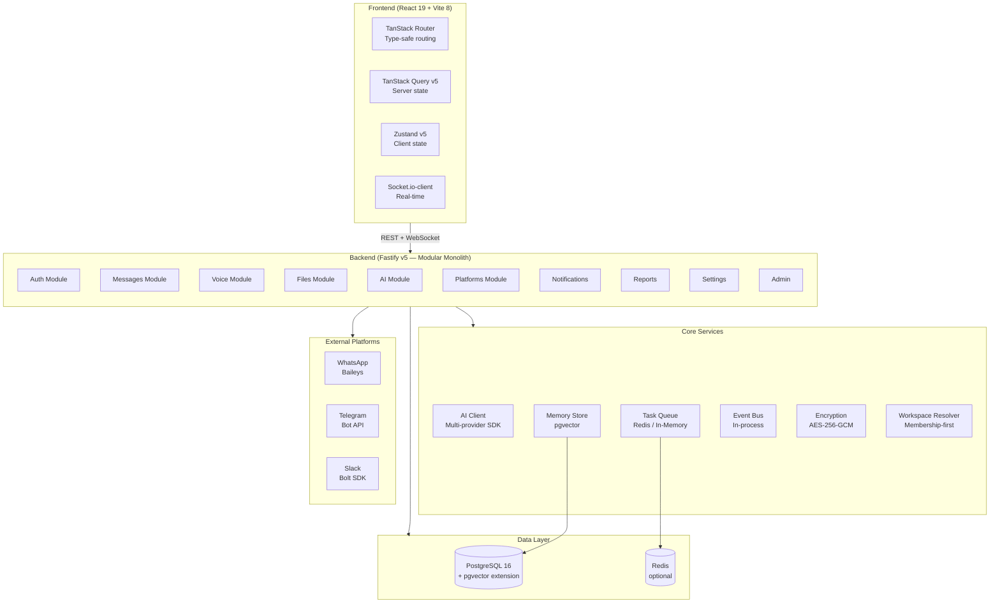
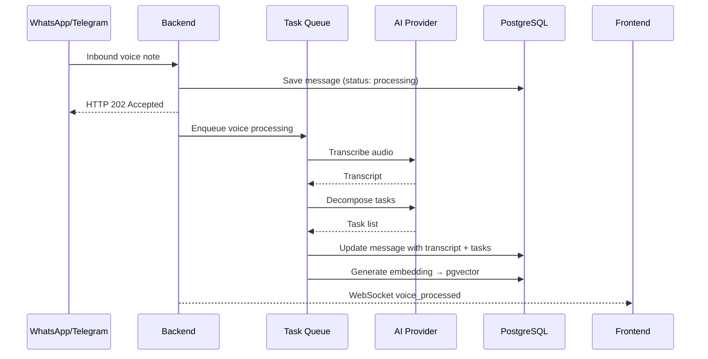
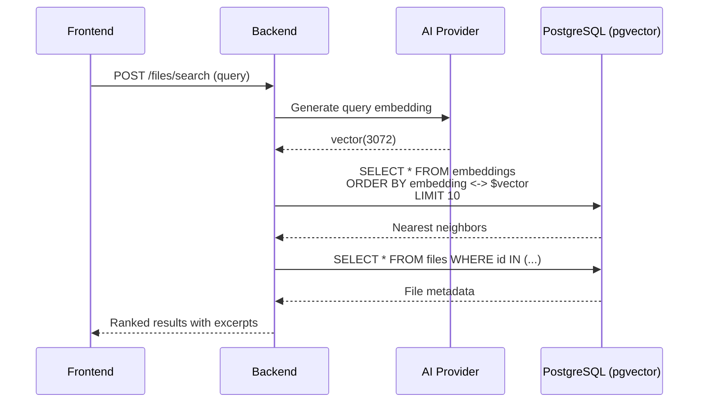
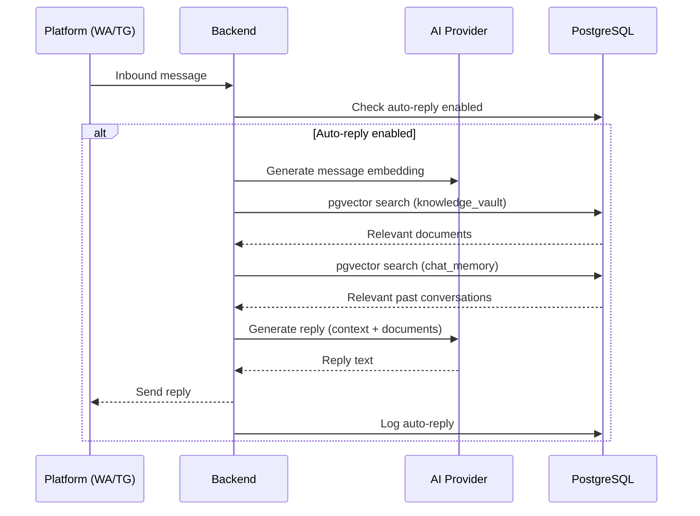

# Ghost Relay Architecture (Modular Monolith)

This document outlines the complete architecture of Ghost Relay — structured as a **Modular Monolith** within a **Monorepo** using Bun workspaces.

---

## 1. Architectural Overview



---

## 2. Monorepo Directory Structure

```
Ghost-Team/
├── apps/
│   ├── backend/              # Fastify API server
│   │   └── src/
│   │       ├── core/         # AI client, encryption, memory, workspace, task queue
│   │       ├── modules/      # Domain modules (12 modules)
│   │       └── plugins/      # Fastify plugins (auth, socket)
│   └── frontend/             # React SPA
│       └── src/
│           ├── routes/       # TanStack Router pages
│           ├── components/   # UI components (shadcn/ui, ai-elements)
│           ├── hooks/        # TanStack Query hooks
│           └── stores/       # Zustand stores
├── packages/
│   ├── database/             # Prisma schema + client
│   ├── shared/               # Zod schemas + shared TypeScript types
│   └── config/               # Zod-validated env variables
├── docker-compose.yml        # PostgreSQL (pgvector) + app
├── docker-compose.full.yml   # PostgreSQL + Redis + app
├── Dockerfile                # Multi-stage build (Bun)
├── turbo.json                # Turborepo task pipeline
└── package.json              # Bun workspace root
```

---

## 3. Inter-Module Communication (Event-Driven)

The backend employs an **Event-Driven Architecture** in-memory using an `EventBus` (`event-bus.ts`). Modules remain independent (loosely coupled) without invoking each other's logic directly.

**Example Flow:**
1. A new message is received via Webhook / REST.
2. The receiving module emits a `message:created` event through the `EventBus`.
3. Other modules (voice, memory, etc.) listen for this event and perform tasks asynchronously outside the HTTP request-response cycle.

---

## 4. System Layer Details

### Layer 1: Presentation (Frontend)

| Technology | Role |
|-----------|-------|
| React 19 + TypeScript | UI framework |
| TanStack Router | Type-safe client-side routing |
| TanStack Query v5 | Server state (fetching, caching, mutation) |
| Zustand v5 | Client state (UI, sidebar, filters) |
| shadcn/ui + Tailwind CSS v4 | UI components + styling |
| Socket.io-client | Real-time WebSocket connection |

---

### Layer 2: Application (Backend)

| Technology | Role |
|-----------|-------|
| Fastify v5 + Bun | HTTP framework + runtime |
| Better Auth | Session-based authentication |
| Socket.io | WebSocket server |
| Zod (via @ghost/shared) | Request/response validation |

**Domain Modules (12):**
- `auth` — Registration, login, session management.
- `messages` — Chat sessions, message CRUD, history search.
- `voice` — Voice note processing, task decomposition, voice commands.
- `files` — Knowledge Vault upload, vector parsing, semantic search.
- `ai` — Multi-provider LLM chat, streaming response.
- `platforms` — WhatsApp/Telegram/Slack connection configs.
- `notifications` — In-app notification system.
- `reports` — Daily report generation.
- `memory` — Semantic search across all system content.
- `settings` — Workspace parameters, AI providers, invite codes.
- `admin` — User/workspace management (owner only).
- `webhook` — Inbound webhooks from connected platforms.

---

### Layer 3: Business Logic & Background Tasks

| Component | Role |
|----------|-------|
| **Event Bus** (`event-bus.ts`) | In-process event broker for loose coupling. |
| **Task Queue** (`task-queue.ts`) | BullMQ + Redis (fallback: in-memory `setImmediate`). |
| **AI Client** (`ai-client.ts`) | Multi-provider LLM SDK interface (OpenAI, Gemini, Anthropic, Qwen, etc.). |
| **Memory Store** (`memory.ts`) | pgvector-based semantic search. |
| **Workspace Resolver** (`workspace.ts`) | Membership-first workspace resolution. |
| **Encryption** (`encryption.ts`) | AES-256-GCM credentials encryption. |

---

### Layer 4: Data Layer (Database & Vectors)

#### PostgreSQL 16 + pgvector

- **ORM**: Prisma v6
- **Vector Search**: pgvector native extension (`vector(3072)`)
- **Embedding Model**: Gemini embedding-001 / custom (3072 dimensions)
- **Search Method**: Brute-force L2 distance (no HNSW index due to 2000-dim limit)

#### Database Schema Highlights (Prisma)

**Key Tables:**

| Table | Purpose | Key Columns |
|-------|---------|-------------|
| `User` | User accounts | `id`, `email`, `passwordHash`, `name`, `role`, `position`, `department`, `tonePreference`, `bio` |
| `Workspace` | Multi-tenant workspaces | `id`, `name`, `inviteCode`, `ownerId` |
| `WorkspaceMember` | Team membership | `userId`, `workspaceId`, `role` |
| `ChatSession` | Conversation sessions | `id`, `userId`, `workspaceId`, `title`, `platform` |
| `Message` | Chat messages | `id`, `userId`, `sessionId`, `content`, `platform`, `messageType` |
| `File` | Knowledge Vault files | `id`, `userId`, `workspaceId`, `originalName`, `storagePath` |
| `Embedding` | Vector embeddings | `id`, `referenceId`, `collection`, `document`, `embedding vector(3072)` |
| `PlatformConnection` | Platform integrations | `id`, `userId`, `platform`, `credentialsEncrypted` |
| `AIProvider` | LLM provider configs | `id`, `userId`, `providerType`, `apiKey`, `modelName` |
| `Notification` | In-app notifications | `id`, `userId`, `title`, `message`, `isRead` |
| `AutoReplyLog` | Auto-reply history | `id`, `workspaceId`, `triggerMessageId`, `replyMessageId` |

#### Architectural Decision: No Foreign Key Constraints

15 out of 17 relation foreign keys were removed from the schema. Only `Session.user` and `Account.user` are retained (required by the Better Auth adapter).

**Rationale:**
- Facilitates modular monolith decomposition into microservices in the future.
- Referential integrity is enforced at the application layer.
- All `@@index` annotations are preserved for fast query execution.
- Workspace resolutions are handled via application-level helper functions (`findWorkspaceByMember`, `findWorkspaceByMemberRole`).

---

### Layer 5: External Integrations

| Platform | Protocol | SDK/Library |
|----------|--------|-------------|
| WhatsApp | WebSockets + webhook | Baileys |
| Telegram | Bot API + webhook | grammy / node-telegram-bot-api |
| Slack | Bolt SDK + Socket Mode | @slack/bolt |
| LLM Providers | REST API | Vercel AI SDK (`ai` + `@ai-sdk/*`) |

---

## 5. Main Data Flows

### Scenario 1: Voice Note Processing



### Scenario 2: Semantic Search (Knowledge Vault)



### Scenario 3: Auto-Reply (RAG)



---

## 6. Security Architecture

| Component | Implementation |
|----------|-------------|
| **Authentication** | Better Auth (session-based, Prisma adapter) |
| **Credential Encryption** | AES-256-GCM (utilizing crypto PBKDF2) |
| **API Key Masking** | Masked in backend responses (e.g., `sk-••••••••1234`) |
| **Access Control** | File scope (`workspace` / `private`), workspace memberships |
| **CORS** | Configurable allowed origins in config |
| **Body Limit** | 5MB maximum request size |
| **Webhook Auth** | HMAC-SHA256 (Slack), secret token (Telegram) |

---

## 7. Design Patterns

| Pattern | Implementation | Rationale |
|------|-------------|--------|
| **Modular Monolith** | `apps/backend/src/modules/` | Domain logic separated inside a single process — easy deployment, ready to decompose |
| **Monorepo** | Bun workspaces + Turborepo | Type and schema sharing across packages |
| **Event-Driven** | In-process `EventBus` | Loose coupling between modules |
| **Repository Pattern** | Prisma client per module | Clean data access abstraction |
| **Manual Lookups** | No FK, application-level joins | Microservice-ready, independent schema evolution |
| **Task Queue** | BullMQ + Redis (in-memory fallback) | Background processing without hard dependencies |
| **Vector Search** | pgvector native | No external SaaS vector database dependencies |

---

## 8. Deployment Specifications

| Target Environment | Deployment Method |
|--------|--------|
| **Local Dev** | `bun dev` (concurrent backend + frontend) |
| **Docker** | `docker compose up -d` (PostgreSQL + app) |
| **Cloud** | Alibaba Cloud ECS via SSH (see `deployment.md`) |
| **CI/CD** | GitHub Actions (build → typecheck → lint → test → deploy) |
